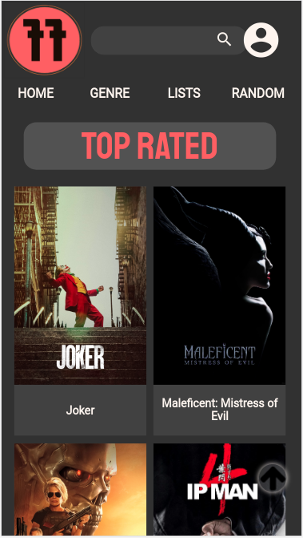

# Film Fest

##  Overview

Film Fest app aims to offer to their userbase a realiable source of information about films and how the public is evaluating them, granting always updated info to them.

## Link to the project (mobile version): https://ff-productions.herokuapp.com

# Features

Film Fest app provides updated movie profiles that can be searched by term and genre. Also offers a movie shuffle for those who doesn't know what to see and want to be surprised

To unlock other features it is necessary to login

In order to deliver a more customized experience, film fest also offers watchlist function to save your favourite movies or those that you want to see in a future.

# Tech Specs

## Functional Description

>Search, movie specs, genre lists and random movies are ready to use without login. Personal area and watchlist only are reachable and fully functional when we login.

## Technical Description

>Film Fest uses two databases, on one hand uses SKYLABCODERS HEROKUAPP which provides a secure database to store our users information. On the other hand, our other database is THE MOVIE DB which offers updated movie profiles.

>Film Fest component structure allow to re-utilize them for different uses, like landing component

>When we run Film Fest we arrive on landing where Initial Movies logic provides trending movies from now and ever. we can use it as movie searcher, but in order to activate watchlist function it is necessary to register and login.

>App processes are always logged into THE MOVIE DB database in order to offer searchs, querys and movie specs.

>All logic have been tested with Jasmine Framework